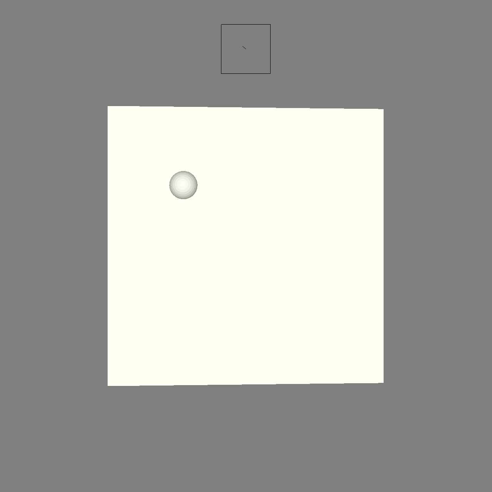

# (TODO: your game's title)

Author: Pengtao Ni

Design: Balance the ball on the board. There is randomly generated wind.

Screen Shot:

How To Play:

Arrows keys to control the rotation of the board. R to restart. W to turn on/off wind.

Sources: None.

This game was built with [NEST](NEST.md).

